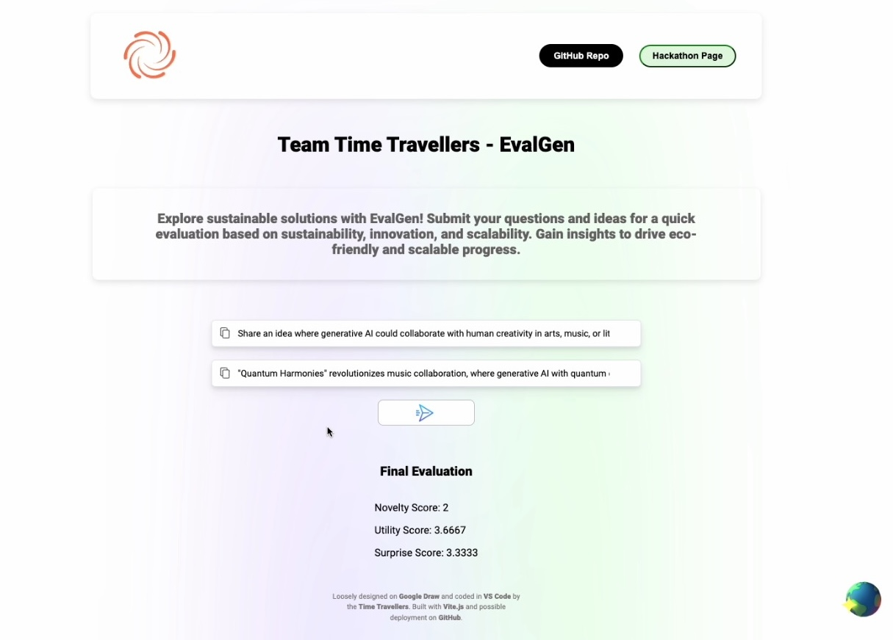

# AI-EarthHack
> EvalGen evaluates, sorts, and finds the best ideas from large sets of problem/solution pitches pertaining to sustainability, innovation, and scalability.

### Use of Generative AI
We used generative AI for embedding solutions and storing them to our database. We perform a cosine similarity search to find the closest three solutions in the database. We average out the scores and store this new solution to expand the model. Something surprising was the difference in vector size when using different models.
### Technologies
We used Redis as our vector datastore. FastAPI hosts the REST API for the backend. Pandas was used to process the CSV file for importing. Docker was to enable consistent deployment on member machines. Langchain was used to simplify integration between technologies.
### Deployment and Implementation
Since the project is containerized through Docker, we can deploy to any cloud provider including AWS and Azure. Using GitHub actions, we can continuously implement and deliver the front and backend. The vector database is hosted on Redis cloud, which has multiple subscription tiers. Changing to another database would also not be a challenge.